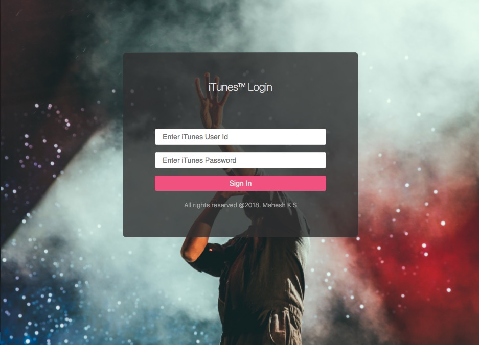
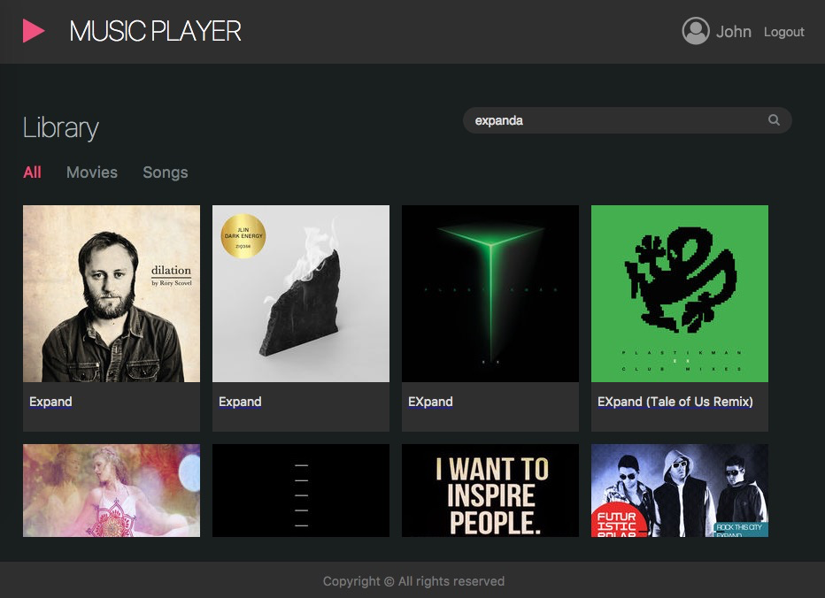
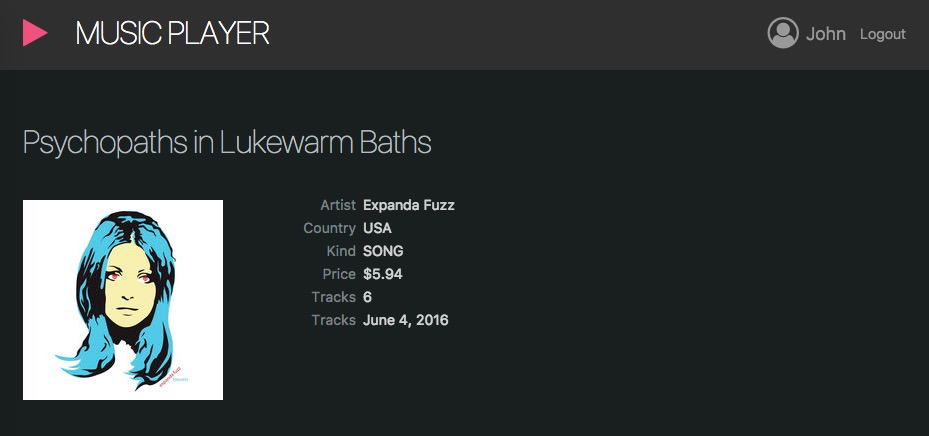

# iTunes Media Portal

In this project, an user can login to the portal via login page. Upon login user can search for music from iTunes. Search results lists all musics and upon clicking on a music tile will display its details

## User Credentials
```bash
Username : john
Password : test1234
```

## Getting Started

Clone the project
```bash
git clone 'https://github.com/mahesh-k-s/code-challenge-interview.git'
```
or

download the zip and extract to a local directory

## Installing

```bash

# install dependencies
npm install

# serve with hot reload at localhost:3000.(Make sure you open a webbrowser with web security disabled, so project will auto-render to that browser)
npm start

# build for production with minification
npm run build

```

## Running the tests
```bash

# run unit tests
npm test

```

## Built With

- ReactJS (create-react-app)
- Redux as the state management
- JavaScript [`ES6`]
- [`Webpack 2.x`] as module bundler
- [`Babel JS`] as the compiler.
- [`React Router v4`]
- [`Enzymes`] as the test library.
- [`Jest`] as testing framework

## Screens

### Login Screen


### Home Screen


### Details Screen


> Design inspiration https://dribbble.com/shots/2125746-Music-Player-App-Dark-Light

## License

This project is licensed under the MIT License - see the [LICENSE.md](LICENSE.md) file for details
